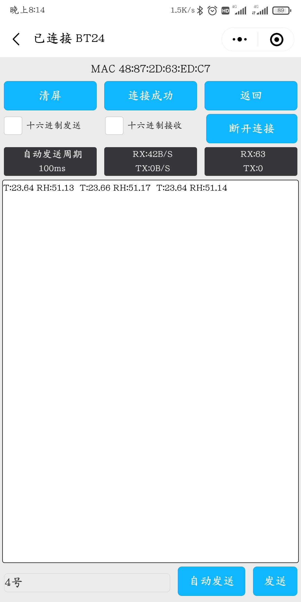

# 51单片机温湿度计

## 说明

这个分支采用低功耗蓝牙（BLE）接收数据。

## 准备工作

#### 硬件准备

硬件都是我自己掏钱买的，有很多替代品，你也可以选择自己喜欢的硬件进行开发&复刻。

| 名称           | 本例使用的型号 | 购买连接                                                     |
| -------------- | -------------- | ------------------------------------------------------------ |
| 51单片机开发板 | STC89C52       | \                                                            |
| 低功耗蓝牙模块 | DX-BT24 BLE5.1 | [BT24低功耗蓝牙模块无线串口通信透传BLE5.1/5.0兼容HC08替CC2541-淘宝网](https://item.taobao.com/item.htm?spm=a1z09.2.0.0.21742e8deXzB3k&id=621716432187&_u=d3enn5lf3177) |
| 温度传感器     | SHT30          | [SHT20 SHT30/31/35温湿度传感器模块I2C通讯数字型 宽电压 传感器-天猫](https://detail.tmall.com/item.htm?id=595422048645&spm=a1z09.2.0.0.21742e8deXzB3k&_u=d3enn5lf97cc) |

#### 蓝牙调试

随便找一款能够进行蓝牙串口调试的软件就行了。

#### 硬件连接

硬件连接框图：


##### 低功耗蓝牙模块（DX-BT24 BLE5.1）与51单片机引脚连接

| DX-BT24 BLE5.1 | STC89C52  | 说明                                 |
| -------------- | --------- | ------------------------------------ |
| STATE          | P3.2      | 用于指示蓝牙连接状态，高电平为已连接 |
| RXD            | TXD(P3.1) |                                      |
| TXD            | RXD(P3.0) |                                      |
| GND            | \         |                                      |
| VCC            | \         |                                      |
| EN             | \         | 悬空                                 |

##### 温湿度传感器（SHT30）与51单片机引脚连接

| SHT30 | STC89C52 |
| ----- | -------- |
| SCL   | P2.0     |
| SDA   | P2.1     |
| GND   | \        |
| VCC   | \        |

## 快速开始

### 1、编译并且烧录程序

使用 ```keil```  打开 ```C52\mainProj.uvproj``` ，编译并且将其生成的可执行文件 ```*.hex``` 烧录到51单片机中。

### 2、使用蓝牙串口工具 连接低功耗蓝牙设备



